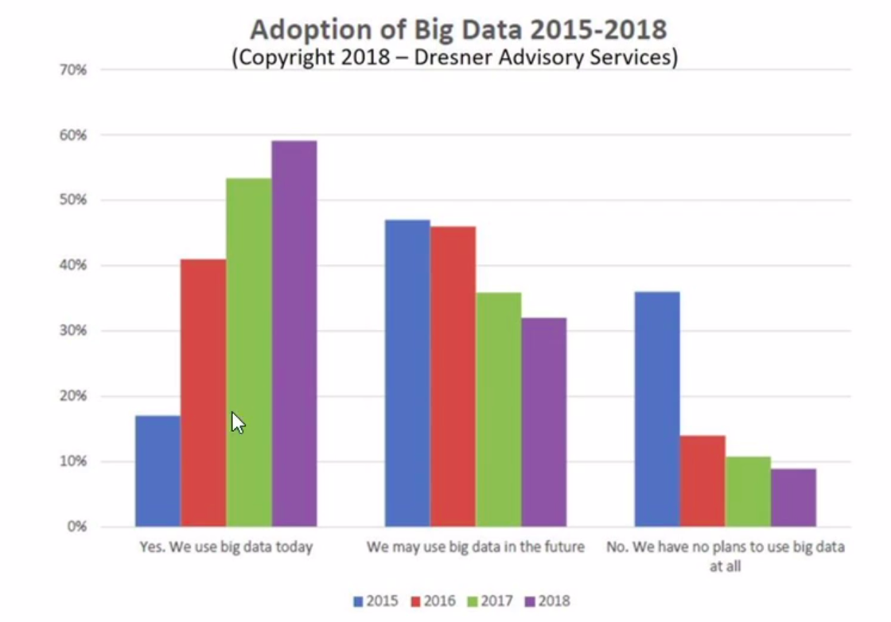
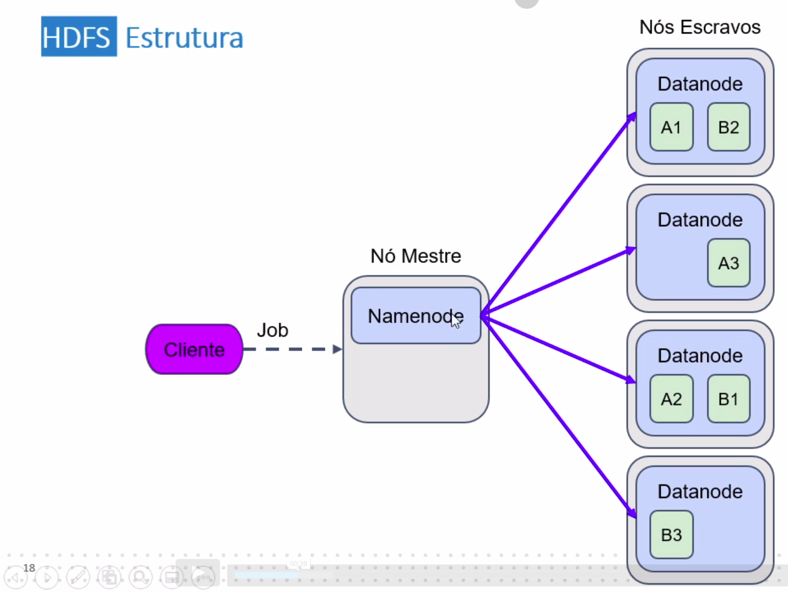
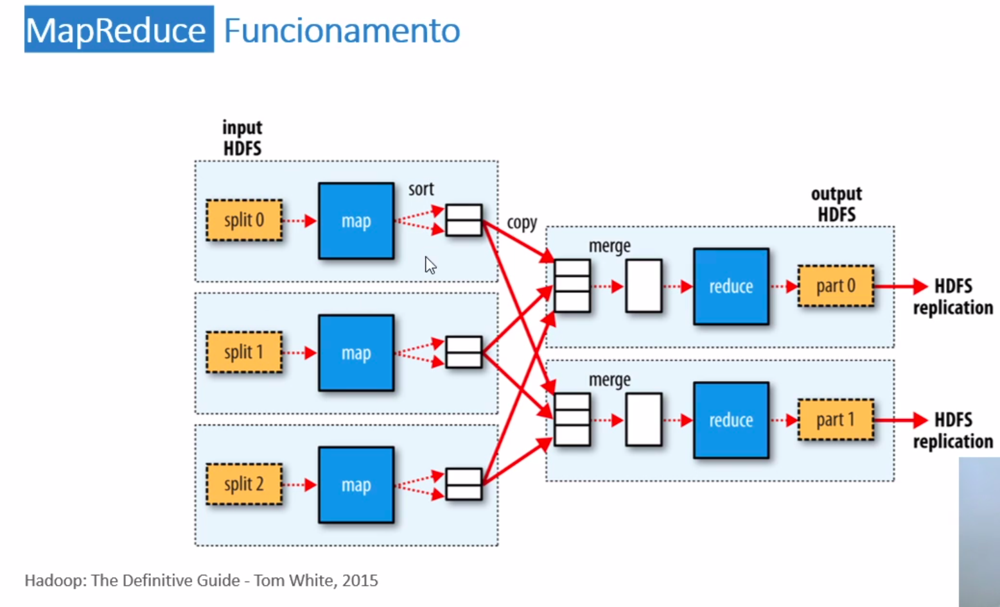
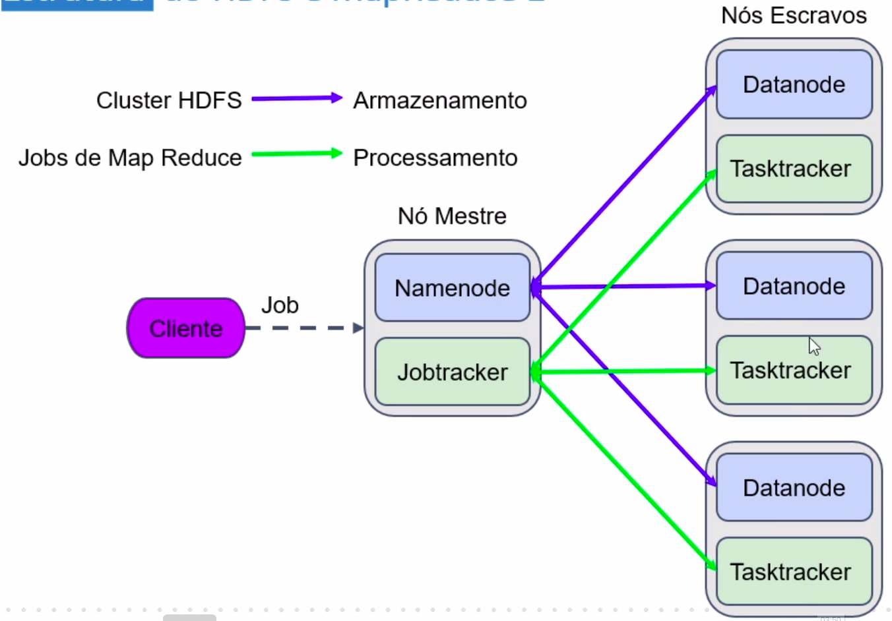
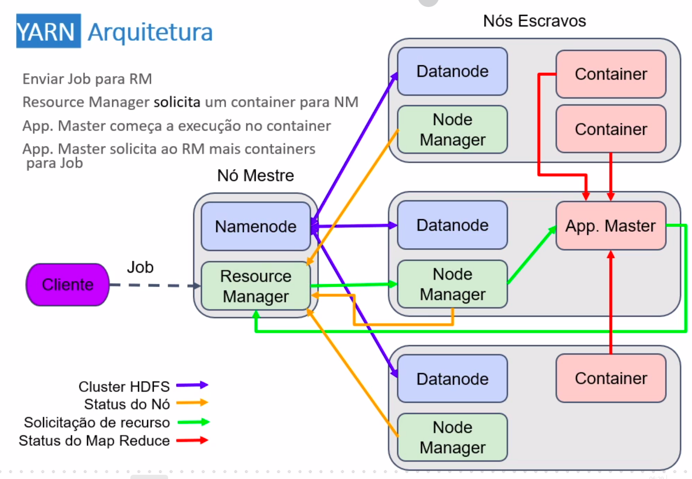
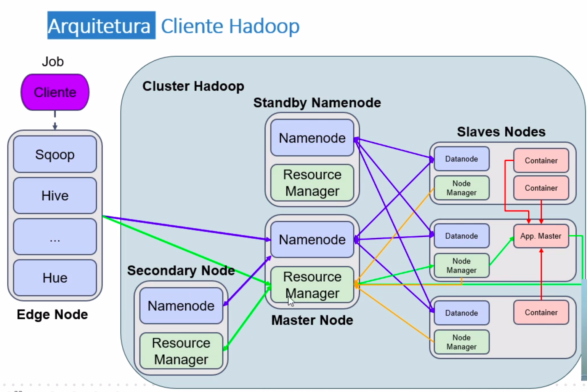
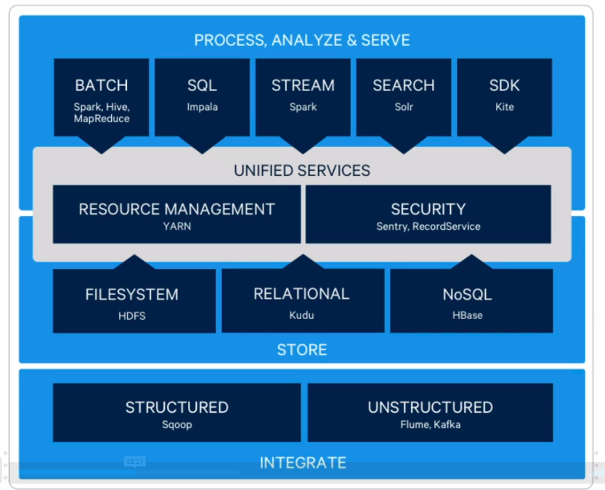
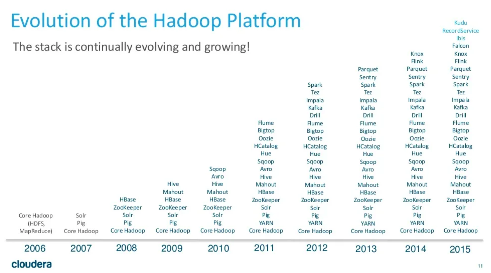
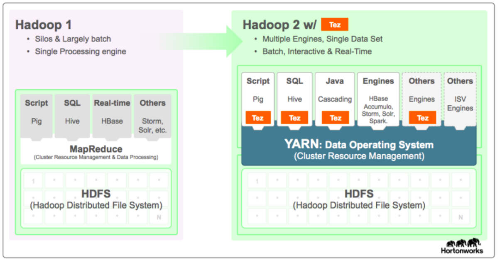

# Introduction

## The pillars of big data

​	The use of big data has increased in a very large scale in the last few years:



​	With that in mind, we can list a couple of items that are the very pillars of big data:

- Volume: a big volume of data, something around the petabytes.
- Velocity: performance.
- Variety: good variety of data sources.
- Veracity: how much we can trust the collected data .
- Value: the income it generates to the client.

	### About the architecture

​	To storage, process and analyze our data, we use an horizontal architecture to storage, process and analyze our data. On this approach, we use the idea of distributed computation: use many machines to divide the computational work of one big task.

# Hadoop

​	Hadoop is a free and open source software for reliable and scalable distributed computation, made to be used with big data using the idea of hardware commodity.

## History:

- In February of 2003, Google created the Map Reduce technology to improve their web search service. Its main idea was to use distributed computation.

- In October of the same year, Google created the Google File System, a file system made to storage and process a big amount of the Google data through the Map Reduce.

- In December of 2005, the open source Nuth was born. It was pretty much an implementation of the Google File System, also using the Map Reduce.

- In February of 2006, Yahoo invested on the Apache independent project, Hadoop.

- In September of 2009, Cloudera distributed a commercial version derivative from Hadoop.

### How does it works?

It works in two principal steps:

1. Map/Reduce
	- Division of the task in smaller fragments of jobs.
	- Any of them can be executed or reexecuted in any node of the cluster.
2. HDFS (Hadoop Distributed File System)
	- Storage the data in nodes.
	- Provide a high bandwidth through all the Map Reduce cluster.
	- All the errors are reexecuted by Hadoop's framework itself.

# HDFS

​	HDFS stands for Hadoop Distrubuted File System.

## Advantages

- Low cost.
- Tolerant to errors.
- Scalable.

## File storage in HDFS

- The files are divided in smaller blocks, each of them with 128 MB.
- These files are stored on the cluster worker nodes.
- HDFS assumes that the worker nodes aren't 100% reliable, so copies three copies of the stored blocks.
- Uses the main/worker architecture. The main (NameNode) stores the file metadata, keeping track of its position and state through the process, and the worker (DataNode), that stores the data itself.
  - main: NameNode
    - Stores the files metadata.
    - Principal component of the HDFS.
  - worker: DataNode
    - Stores the data itself.

## The HDFS Structure



​	As seen in the above image, the NameNode keeps track of each DataNode. The A1 and B2 are in the first cluster, so if it drops for some reason, there are copies of this blocks to give us some assurance.

# What is MapReduce?

​	MapReduce is a framework that divides and manages the work of a task between several cluster machines, giving each of them an independent task.



​	In the above example, the jobs previously divided by the HDFS now the are mapped and them reduced.

### MapReduce operations

- Split
- Map
- Shuffle
- Reduce

# MapReduce Hello, world!

​	A good example of Hello World is to make a word counter program. Let's think of the following situation:
​	You have 2 files with one word per line, and want to count how many times each word appears on those files. You can use the Map/Reduce operations to do so:

```bash
# first.txt
word
cry
amount
level
amount
```

```bash
# second.txt
amount
power
power
cry
trying
power
```

​	Step 1: map these files in a key value structure:

```bash
# first.txt
word: 1,
cry: 1,
amount: 2,
level: 1
```

```bash
# second.txt
amount: 1,
power: 3,
cry: 1,
trying: 1
```

​	Step 2: shuffle our data.

```bash
word: (1, 0),
cry: (1, 1),
amount: (2, 1),
level: (1, 0),
power: (0, 3),
cry: (1, 1),
trying: (0, 1)
```

​	Step 3: reduce.

```bash
word: 1,
cry: 2,
amount: 3,
level: 1,
power: 3,
cry: 2,
trying: 1
```

# Map Reduce Structure

​	Each job, defined previously by the HDFS, is processed by a daemon.

​	We have two types of daemons in our structure:

1. One Jobtracker
   - Manages all the jobs executed on the system.
   - Stores the history of tasks.
2. Many Tasktracker
   - Executes the tasks and send reports to the Jobtracker.

​	This adds up with our previous idea of NameNodes and DataNodes inside the HDFS structure:



​	So the Namenode and the Datanodes are used to store our data, while the Jobtracker and the tasktrackers are used to process this data.

# YARN

​	Note: this YARN has nothing to do with the Yarn package manager.

​	YARN stands for Yet Another Resource Negotiator. It a Map Reduce framework used within the Map Reduce structure to offer parallelism, and to separate the jobs through more daemons.

​	At Hadoop version 1 or before, we say it uses the "Map Reduce 1". In higher versions, we say it uses "Map Reduce 2", in other words, Map Reduce 1 with YARN.

## YARN Modes

- Local mode: standalone.
- Pseudo distributed mode: Single Node Cluster.
- Totally distributed mode: Multi Node Cluster.

## YARN Architecture

​	Its architecture is very similar to the Map Reduce 1 architecture, but with some updates:

- We use many daemons to execute the jobs.
- We have 1 Resource Manager (RM), that manages the tasks executed by the system.
- We have 1 Application Master (AM), that watches and manages the Node managers.
- We have 1 or 0 Timeline Servers, that stores the history of the application.
- We have many Node Managers, that executes the tasks and send reports to the AM.



# Other Types of Nodes

## The Secondary Node

​	Just a quick reminder:

- Namenode: manager of the Datanode, that are the workers who stores the data in the HDFS structure.
  - FsImage: stores all the structural information of each block.
  - EditLog: logs the updates in each file.

​	The Secondary Node creates checkpoints on the NameNode each time we send a new job, using a file called `fsImage.ckpt`. (fsImage.ckpt = FsImage + EditLog).

​	If our Namenode goes down, the Secondary Node will take his place, but it demands a manual human work, so it's not really recommended. To fix this, we use the...

## Standby Namenode

-	In production and on real big data applications, we use a Standby Node.
-	In this case, we have two Namenodes on our application: the main namenode and the standby. Both are updated by the Datanodes, but one of them is active (main) and the other is in a wait mode (standby).
-	The standby namenode will takeover if the main namenode goes down.

## Edge Node

​	AKA Gateway Node.

- Gateway Nodes are the interface between the Hadoop cluster and the external network.
- Diminish the use of the Namenode.
- Executes the clients applications.
- Transfer the data to the Hadoop cluster.
- It is a management tool.

# Hadoop Client Architecture



# What is a Data Lake?

​	A data lake is the place where our data is **ingested**, **stored**, **processed** and **analyzed**.

​	The main difference between a data lake and a old school data warehouse is in the method of inserting the data:

- In a data warehouse, we would need to be very careful about the formats of ingestion, such as SQL, JSON, XML, CSV, binary, etc.
- In a data lake, we can use several tools for that, such as Sqoop, Apache Kafka, Flume, Beats, etc. This way, we have much more flexibility to handle our data sources.

​	When a data lake has a bad data ingestion, it becomes a data swamp, once the its data is now "polluted".

# Cloudera and Hortonworks

## Cloudera

​	Cloudera is a pioneer company in the use of big data to improve their services. We can see a little big about the technologies they use on the following image:



## Hadoop's Stack of Technologies

​	In the following image, we can see the development of the Hadoop platform through the years, since it was created in 2006.

 

## Hortonworks

​	Hortonworks is another company, with pretty much the same history as Cloudera. We can see some of their tech here:


