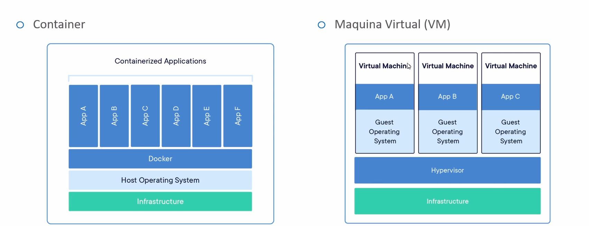

# Docker

​	First of all, let's clarify the difference between a container and a virtual machine:

​	Virtual machines are a way of using another operating system inside your machine.
​	Containers isolates (containerize) your application, in a way you don't need to worry about the OS or the infrastructure, since Docker will do it for you.

## Docker Commands

### `docker-compose`

- `docker-compose pull`: downloads all the images to the local workspace.
- `docker image ls`: list all the images.
- `docker-compose up -d`: execute the containers in background mode. It must be used only when the `docker-compose.yml` file is updated.
- `docker-compose start`: starts all the stopped services.
- `docker-compose stop`: stops all the started services.
- `docker container ls`: list all the containers. That is different from the `image ls` command: the container is the image's service.
- `docker-compose down`: kills all the services.
- `docker volume prune`: deletes all the unused volumes.
- `docker system prune --all`: deletes everything: the images and the volumes.

### `docker`

- ` docker ps`: lists all the active containers.
- ` docker ps -a`: lists all the containers.
- ` docker exec -it <container> <command>`: executes commands on the specified container.
- ` docker logs <container>`: shows the logs of the specified container.
- ` docker-compose logs`: shows the logs of all containers.
- `docker cp <dir> <container>:/<dir>`: copies a file or directory to a container.
