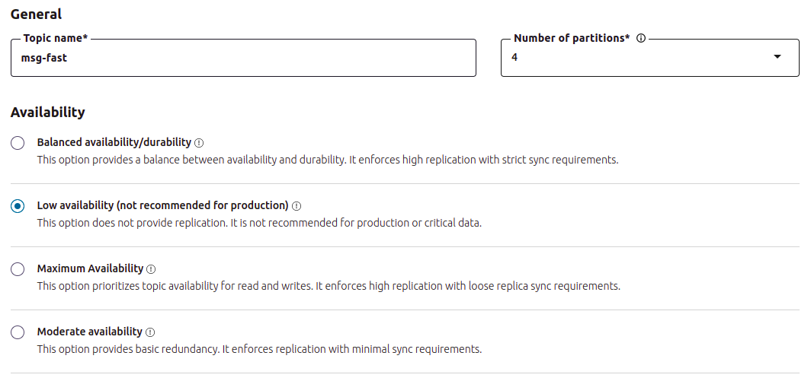
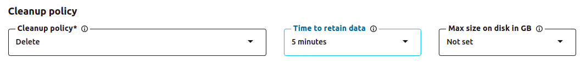
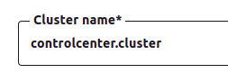
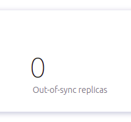
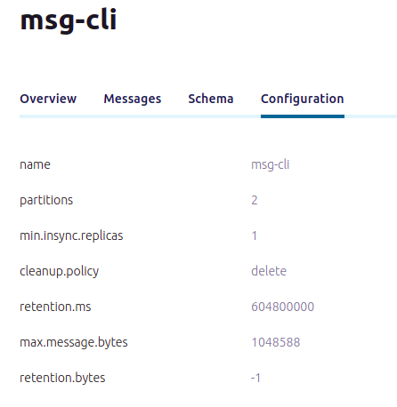
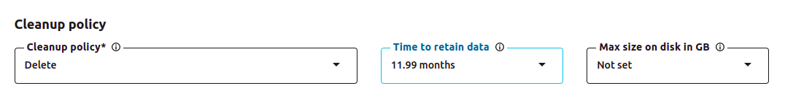
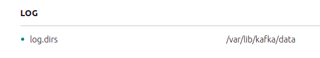

# Exercises - Control Center

1. Create the topic `msg-fast` with 4 partitions and replication factor of 1. Then delete the data after 5 minutes of use.





2. Product and consume 2 messages to the topic `msg-fast`

```bash
# starting the consumer
kafka-console-consumer --bootstrap-server localhost:9092 --topic msg-fast --group consumers

# starting the producer
kafka-console-producer --broker-list localhost:9092 --topic msg-fast
>first
>second

# output on the consumer:
# first
# second
```

3. What is the name of the cluster?




4. How many topics there are on the cluster?


5. How many partitions exists on the topic `msg-cli`?


6. All the replicas are in-sync on the topic `msg-cli`?




7. What is the cleanup policy of the topic `msg-cli`?	



8. Alter the cleanup policy of the topic `msg-cli` to delete after one year.



9. What is the directory of log storage of the cluster?



10. By default, the data is kept for how many days on Kafka?

604800000 milliseconds, that is, 7 days.
