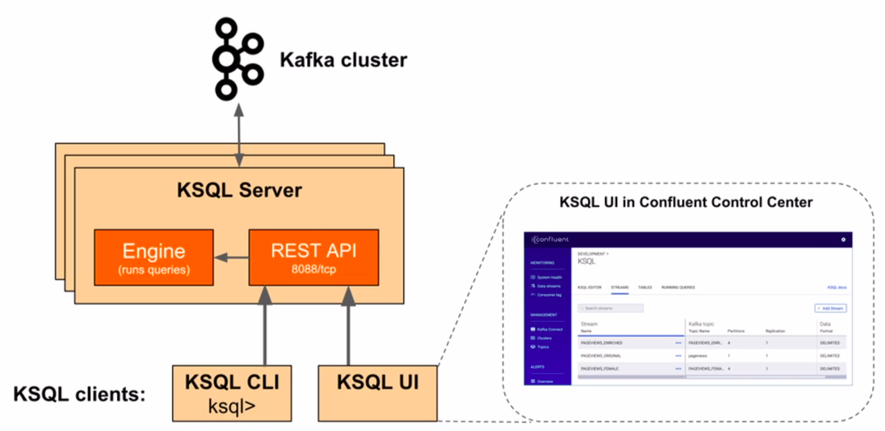

# KSQL

## What is KSQL?

​	KSQL is a Kafka SQL streaming engine. It was made to be an interactive SQL interface, easy to use and focused on the streaming process with Kafka.
​	KSQL has the same advantages as a usual Kafka cluster, such as scalability, fault tolerance and real time operations. It also supports many streaming operations, such as transformations and aggregations.



​	The KSQL CLI and the KSQL UI, available on Confluent Control Center, are the two of the ways to access the KSQL engine. Both these tools are processed by the REST API of the KSQL Server, who access directly the Kafka cluster.

## Command examples

​	Visualize all the topics.

```bash
ksql> list topics;
```

​	Shows the content of a topic in real time

```bash
ksql> print "<topicname>" <properties>;
```

​	Properties:

- `from beginning`
- `interval`
- `limit`

```bash
ksql> print "product" from beginning interval 5 limit 10;
```

## KSQL Stream

### What is a KSQL Stream?

​	KSQL Stream is a structured data sequence inside the Kafka topics. They can't be deleted or updated, only added. To delete any data, you need to delete the entire stream.
​	They can be created from a Kafka topic or derived from an existing stream. It is necessary to provide the format of the data stored on the topic.

### Creating a stream

```sql
ksql>create stream <streamname>
>(
>  <field> <type>,
>  <field> <type>
>) with (
>  kafka_topic='<topicname>',
>  value_format='<format>',
>  KEY='<keyfield>',
>  TIMESTAMP='<timestampfield>'
>);
```

- `format`:
  - `DELIMITED (, CSV)`
  - `JSON`
  - `AVRO`
- `type`:
  - `BOOLEAN`
  - `INTEGER` or `INT`
  - `BIGINT`
  - `DOUBLE`
  - `VARCHAR` or `STRING`
  - `Array`
  - `Map`
  - `Struct`

#### CSV Example

​	Creating the stream with KSQL:

```sql
ksql>create stream user_csv
>(
>  name string,
>  city string
>) with (
>  kafka_topic='user_topic',
>  value_format='delimited'
>);
```

​	Inserting the data on the producers:

```bash
>Rafael,São Paulo
>Danilo,São Paulo
```

#### JSON Example

​	Creating the stream with KSQL:

```sql
ksql>create stream user_json
>(
>  name string,
>  city string
>) with (
>  kafka_topic='user_topic',
>  value_format='json'
>);
```

​	Inserting the data on the producers:

```sql
>{'name': 'Rafael', 'city': 'São Paulo'}
>{'name': 'Danilo', 'city': 'São Paulo'}
```

#### From CSV/JSON to Avro Example

​	In this example, we will create a new topic and fill it with data from a CSV/JSON source to Avro format, very used with data serialization.

​	CSV:

```sql
ksql>create stream user_avro with
>(
>  kafka_topic='user_avro',
>  value_format='avro'
>) as select * from user_csv;
```

​	JSON:

```sql
ksql>create stream user_avro with
>(
>  kafka_topic='user_avro',
>  value_format='avro'
>) as select * from user_json;
```