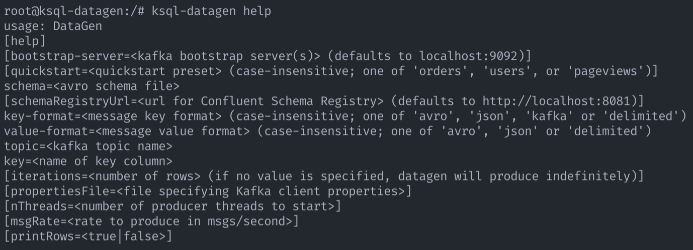

# KSQL Datagen

​	KSQL Datagen is a CLI tool for generating test data. Datagen stands for data generation, and is only used on development environments, never in production.
​	 It can generate data for different topics, such as orders, users or pageviews. It supports multiple formats, such as Avro, JSON and CSV. You can also use it to study the production of messages, analyzing the amount of messages sent per second.

## CLI Arguments

​	Through the command `ksql-datagen help`, we can quickly see what are the arguments available:

