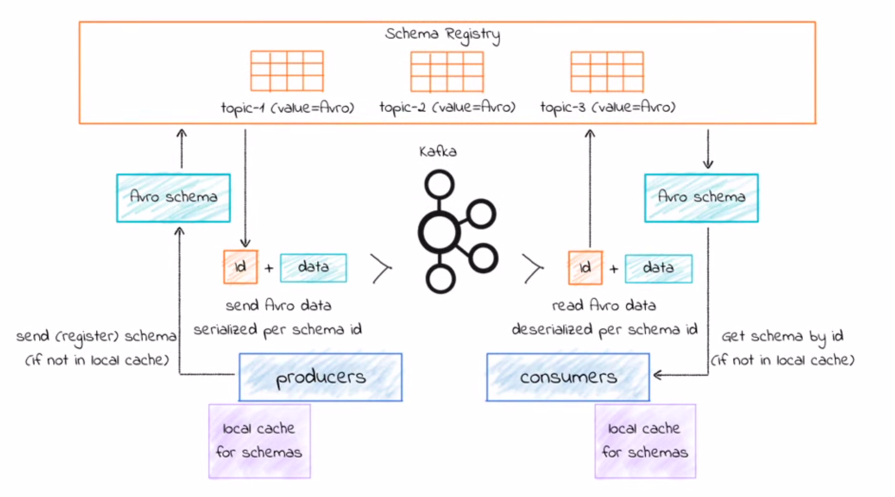

# Schema Registry

## What is Schema Registry?

​	Schema Registry is a distributed storage tool for Avro schemes. It is very uncommon to use the Avro format in Kafka without the Schema Registry.
​	Basically, while Kafka stores data inside topic partitions, the schema registry will store the schemes related to this data. Each schema will have an unique id, in a way that decreases the payload of our data.

​	In the schema above, we can see that the schema registry is a component completely separated from the rest of the architecture. When a message is being produced or consumed, it will be followed by an id. This id will relate to the schema inside the Schema Registry.
​	In short, instead of sending the entire schema along with our data, we send only the data and the schema's id.
​	It also adds a whole new security layer, once a message with the wrong schema will not be accepted by Kafka.
​	Other impressive feature of the Schema Registry is that it can be updated in real time.

## Schema Registry operations

​	All the operations on the Schema Registry is made through the API REST. The available operations are the CRUD:

- create new schemes;
- read existing schemes;
- update existing schemes; and
- delete unnecessary schemes.