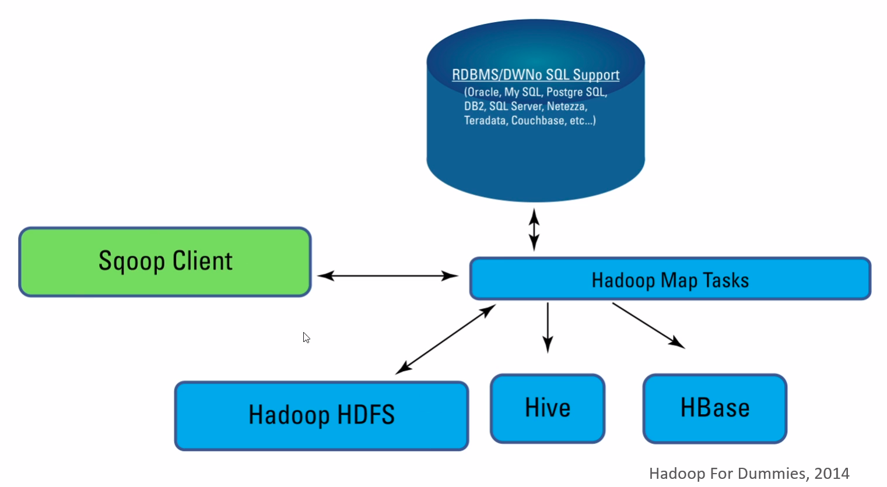

# Sqoop

## Data ingestion

​	Data ingestion is the process in which our data is sent or received from the local environment to the distributed system.

​	Between the tools we have available for data ingestion, we can divide them in two groups:

- Batch: in a batch process, the data flux has a start and an end. An example of tool like this is Sqoop.
- Stream: in a stream process, the data flux has a start, but not an ending. It continues indefinitely. Examples of tools like this are Flume and Kafka.

​	Currently, the most used data ingestion tool is Apache Kafka.

## What is Sqoop?

​	Sqoop stands for "SQL to Hadoop". It is a tool made to transfer data between the HDFS and a relational database (or a mainframe).

- Importing data:
  - From:
    - MySQL;
    - SQLServer;
    - PostgreSQL; or
    - Oracle.
  - To:
    - HDFS;
    - Hive; or
    - HBase.
  - Usually, the data is transfered to HDFS and then transfered to Hive or HBase tables through HDFS.
  - It supports parallel execution.
  - It is tolerant to failures.

- Exporting data:

  - From HDFS to a RDBMS.

## Sqoop's structure

​	Through the Sqoop Client, the data is transfered from the RDBMS to the HDFS.
