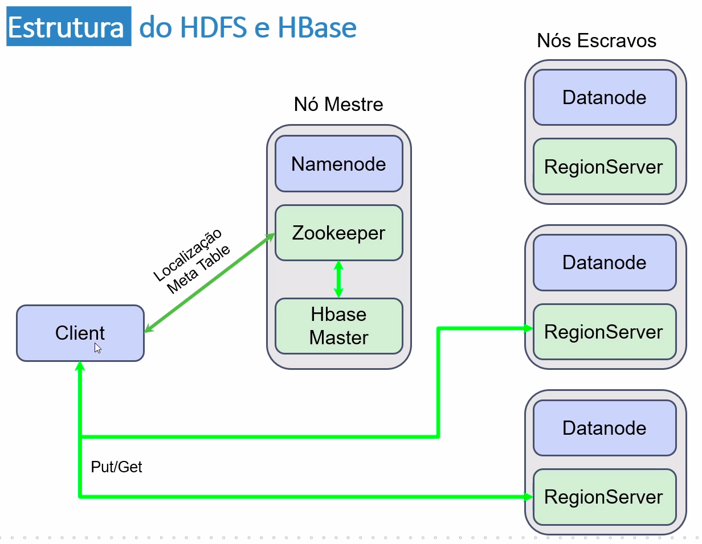
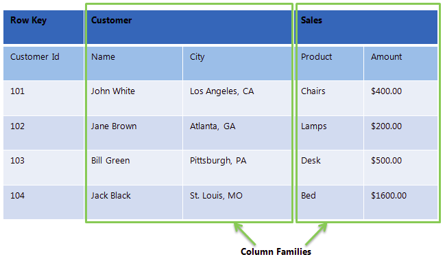

# HBase

## General

- NoSQL and non-relational database.
- Real time database.
- Built on top of the HDFS, meaning it has the HDFS distributed system and its scalability.
- Column-oriented database.
  - The table schema is a sequence of families of columns.
    - Each family of columns is a sequence of key-value pairs.
    - Internally, it uses a hash table structure.

## History

- In 2006, Google published an article about Bigtable, a distributed storage system for structured data.

- One year later, Apache HBase was born, making an open source implementation of the Bigtable architecture.

- In 2008, this project became a Hadoop sub-project. 

## Architecture

- The data is automatically distributed across the cluster.
- A key will divide the data through the nodes, similarly to the Hive partitions.
- Each node, called RegionServer, storages a subset of the data.

### HBase components

- RegionServer: the data contained on the tables is distributed in regions.
- HBaseMaster: manages the RegionServer instances. Works similarly to the namenode from the HDFS.
- Zookeeper: monitors and coordinates the HBaseMaster instances.
- HDFS: namenode, standby node and datanodes.

## Data structure

​	On a common relational database, if we wanted to store data about `customer` and `sale`, we would have one table for each entity, all tables inside the same database `market`, for instance.

​	On the HBase data structure, we don't have databases. All the data is managed inside tables, usually with many columns.

- Table: contains row keys and and column families.
  - Row key: it's pretty much the same thing as a primary key.
  - Column families: groups of columns. In the example above, one possible column family would be the `customer` family.
    - Columns: represents a normal column. On our example, the column family `customer` would have a field called `name`, for instance.
      - Versions: each value inside a cell is controlled with a version (timestamp).

​	Therefore, to access a cell, we would need to know the row id (key), the column family, the column inside the family and the timestamp (version) of the cell.

