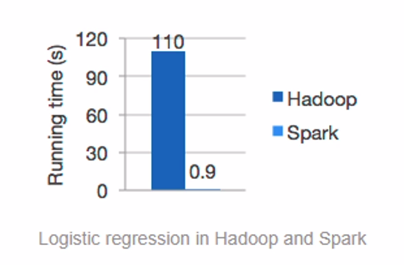

# Spark

## General

​	Apache Spark is a data process tool for big data, such as Map Reduce and Fink. Spark is one of the most used big data tools, being ahead of Fink and Hadoop Map Reduce in that aspect.

​	Spark is a cluster computation platform. It can access all the data inside a Hadoop cluster, such as the local files, the HDFS and the Hive/HBase tables.

​	One of the main advantages of Spark is its velocity: see below a comparison between Hadoop and Spark to perform a logistic regression:

## Languages

​	The Spark engine can be used in four programming languages: Scala, Java, Python and R. In this course, we will learn it with Scala, since it is the most performative and updated version of Spark.

## History

- 2009: Spark was born as a research project on the University of California, called AMPLab.
- 2010: on this year, Spark became open source.
- 2013: Spark joined Apache.
- Currently: Spark is one of the most used tools for big data.

## Spark modules

- Spark: does ETL and batch processing.
- SparkSQL: queries structured data.
- SparkStreaming: stream processing.
- Spark MLib: machine learning.
- Spark GraphX: graph processing.

## `spark-shell`

​	Spark can be used with IntelliJ (Java), Jupyter Notebooks (Python) and many other environments. In this course, we will learn Spark through Spark Shell.

​	When using a cluster with more than one version of Spark installed, use `pyspark2` or `spark2-shell` to specify which version to use

​	Other interesting feature of `spark-shell` is that it already initializes with two variables created: `sc` and `spark`.

- `sc` means Spark context.
- `spark` represents the Spark session.

​	Those variables would need to be manually configured if we were using other environments other than `spark-shell`.
