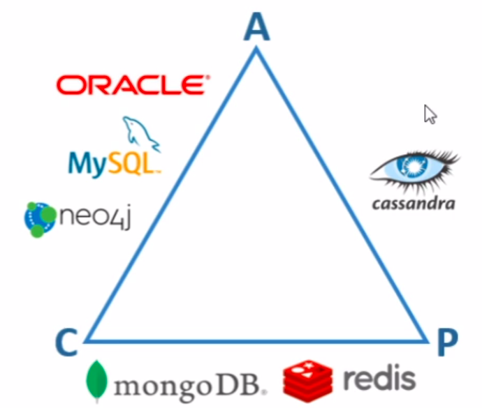

# NoSQL

​	NoSQL stands for "not only SQL" meaning we don't necessarily use the Structured Query Language (SQL) to manage data.

​	Some of the greatest advantages of NoSQL databases are:

- Highly performative.
- Distributed architecture.
- Flexible schemes.

## SQL vs. NoSQL

- SQL:
  - Oriented by rows (MySQL, Oracle, PostgreSQL, etc).
- NoSQL:
  - Oriented by columns (Cassandra).
  - Key-value pairs (Redis).
  - Oriented by documents (MongoDB).
    - Not normalized.
  - Oriented by graphs (neo4j).

## BASE vs. ACID

### BASE

- Basically available: continuously available service.
- Soft-state: doesn't have to be always consistent.
- Eventually-consistent: application becomes consistent eventually.

### ACID

- Atomicity: transactions are all or nothing: executed completely or completely row backed.
- Consistency: guarantee unique vision of the data.
- Isolation: guarantee a transaction won't collide with another.
- Durability: guarantee that what is stored won't be lost.

## CAP Theorem

​	The CAP Theorem says that it is impossible for a distributed storage system to guarantee more than two of the three following guarantees:

1. Consistency: everyone has access to the same data.
2. Availability: the service is always available.
3. Partition tolerance: if the network goes down, the system will continue working.

​	Examples:

