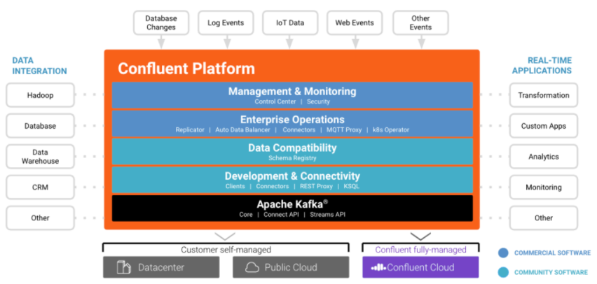

# Kafka

​	Apache Kafka is a distributed streaming platform. It is an open source and fault tolerant tool.

## History

- 2010: originally developed by Linkedin, because of the need of massive data integration.
- 2011: became open source.
- 2012: became Apache Kafka.

## Kafka Cluster

- Developed in Scala and Java.
- Executed as a cluster, in one or more servers, having many datacenters.
- Each message consist in a key, value and datetime.
- Each "category" of messages is called topic.
- Kafka is a management system for real-time data flux.

### Kafka APIs

- Producer API: allows the application to publish a message flux in one or more topics.
- Consumer API: allows the application to assign one or more topics and process the message flux produced for them.
- Streams API: allows the application to transform the input flux into the output flux.
- Connector API: allows the creation and execution of reusable producers and consumers, that connects topics to applications or existing data systems.

## Confluent

​	Confluent is the company behind Kafka. It was created in 2014 by the original Kafka creator, Jay Kreps. It was made to provide, in one single platform, allows you to store your historic events in real-time.

- Simplifies:
  - The creation of data pipelines;
  - The creation of streaming applications in real-time;
  - The integration of data from a variety of sources;
  - The connection of data sources to Kafka;
  - The creation of applications that uses Kafka, using the Kafka infrastructure:
    - Protection.
    - Monitoring.
    - Management.

### Confluent platform

- Data integration: can be done with many data sources, such as Hadoop, data warehouses, CRMs and databases.
