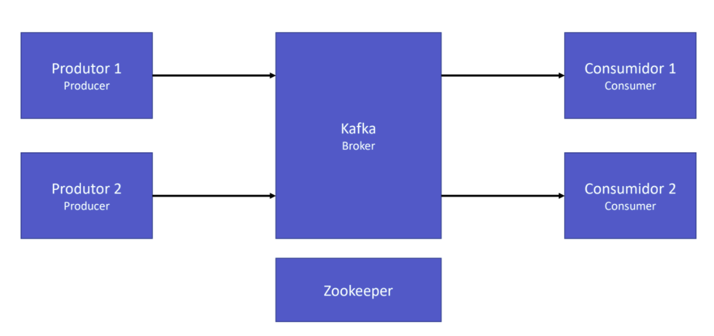
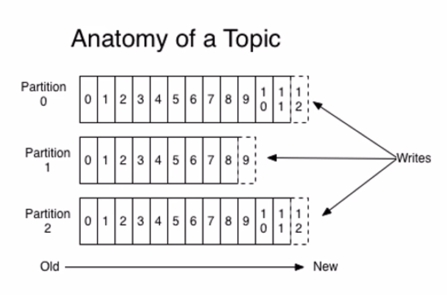
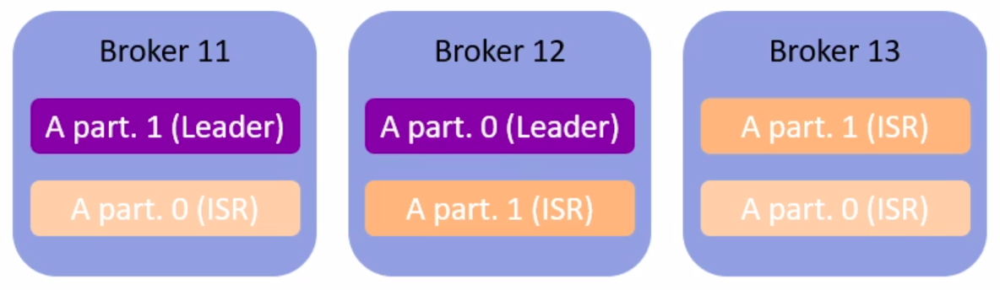
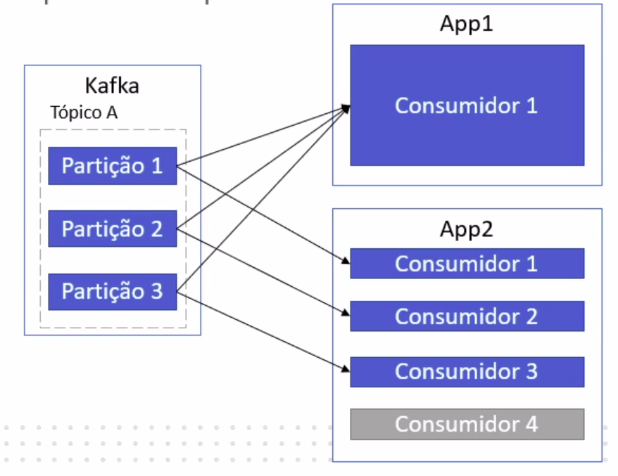
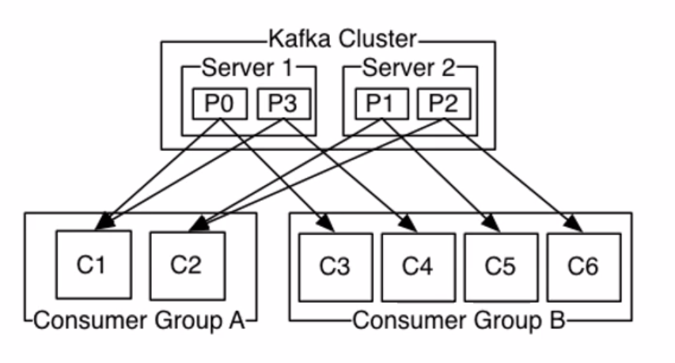

# Kafka's Architecture

​	This is the base structure of a Kafka cluster. It has 4 principal components:

- Broker (server): where the data is stored.
- Zookeeper: responsible for the coordination.
- Producers: who sends the data.
- Consumers: who receives the data.

## Broker

​	Inside the broker, we have topics.

### Topics

​	Comparing the Kafka structure to a SQL RDBMS, topics are like tables. Topics are divided into partitions.

​	All the data in a Kafka cluster is stored inside a partition. Partitions are sequences of immutable messages, identified by a sequential id (offset).

### Broker concepts

​	Broker (or server) is the main component of a Kafka cluster. It is where the topics are stored and managed.

​	In production, it is recommended to have at least 3 brokers, working with one leader and two ISRs: in-sync replica. The ISR works as a way of increasing the data availability, guaranteeing we won't loose data, even if a broker goes down.

​	This is an example of how two topics would be stored across 3 brokers with this architecture:

​	In this example, we wouldn't loose any data, even if two of our brokers went down. Note that an ISR will never be in the same broker as the leader, since this wouldn't make sense.

## Producers

​	Producers are who send data to our partitions. The destiny partitions can be chosen, so we can use this feature to balance the size of each partition.

### Acknowledgements 

- 0: there is no writing confirmation. This setting is usually used in a real time application, in which the data loss isn't so important (faster).
- 1: there is writing confirmation on the leader broker.
- All: there is writing confirmation on all the brokers, including the ISRs (slower).

## Consumers

​	Consumers are who receive our data. Consumers usually doesn't work individually. Instead, they work in groups of consumers.

​	Each message inside a partition is sent to a consumer inside consumer group.

​	The following image explain how the work is divided between different consumer groups.

- If all the consumers are inside the same group: the load is equally divided between the consumers.
- If the consumers are in different groups: each message will be sent to all the processes.

### Example

​	In this example, there are four topic partitions divided in two brokers. There are also two consumer groups: A, with 2 consumers, and B, with 4 consumers.

​	With this scenario, C1 and C2 would read the broker 1 and the broker 2, respectively, while C3, C4, C5 and C6 would read P0, P3, P1 and P2, respectively.
