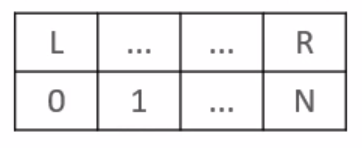

# List

​	On Redis, the implementation of the list type is a linked list data structure.

## Length

```bash
llen <key>
```

## Push

​	When adding a new element, you can do it by the left (start) or right (end) side of the list.



- `lpush <key> <value>`: adds on the left.
- `rpush <key> <value>`: adds on the right.

​	To read the data from a specific range of the list:

- `lrange <key> <start> <end>`
  - Starts at 0.
  - `-1` is the last, `-2` is the penultimate, etc.

## Delete

### Pop

​	Recovers and deletes an element from the list. Returns null if the element doesn't exists.

- `lpop <key>`: removes at the beginning of the list.
- `rpop <key>`: removes at the end of the list.
- `blpop <key> <time>`: during the specified time (in seconds), tries to perform a `lpop`.
- `brpop <key> <time>`: during the specified time (in seconds), tries to perform a `rpop`.

​	Both `blpop` and `brpop` will return null if the list is empty and the time ends without new data.

### Trim

​	Redefines the list with a new specified range, removing all the elements outside of this range.

```bash
ltrim <key> <newstart> <newend>
```

