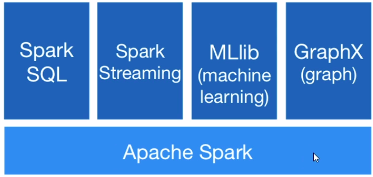
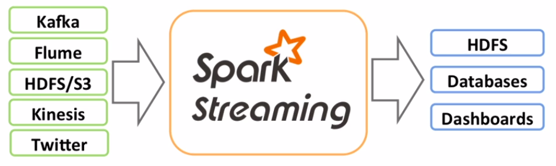
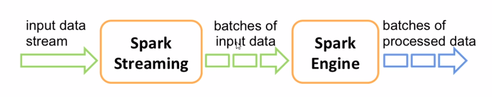

# Spark Streaming Concepts

​	Apache Spark divides itself in 4 main components:

- Spark SQL
- Spark Streaming
- MLib (for machine learning)
- GraphX (graph)

​	Now that we've seen a little of Spark SQL, we will understand better how to work with streaming through Spark.

## What is Spark Streaming?

​	Spark Streaming is an extension of Spark's Core API, serving as a high-level abstraction of Spark's core. In here, we use a structure called DStreams (discretized streams) to manage data, representing a continuous stream of data.

​	Main advantages:

- scalable processing;
- high tranfer rate; and
- fault tolerance.

## How does it work?

​	Spark receives the data to be processed and divides it in micro batches. Then, Spark's engine processes this data and outputs those micro batches of processed data.

​	In this architecture, the DStreams works as sequences of RDDs.
