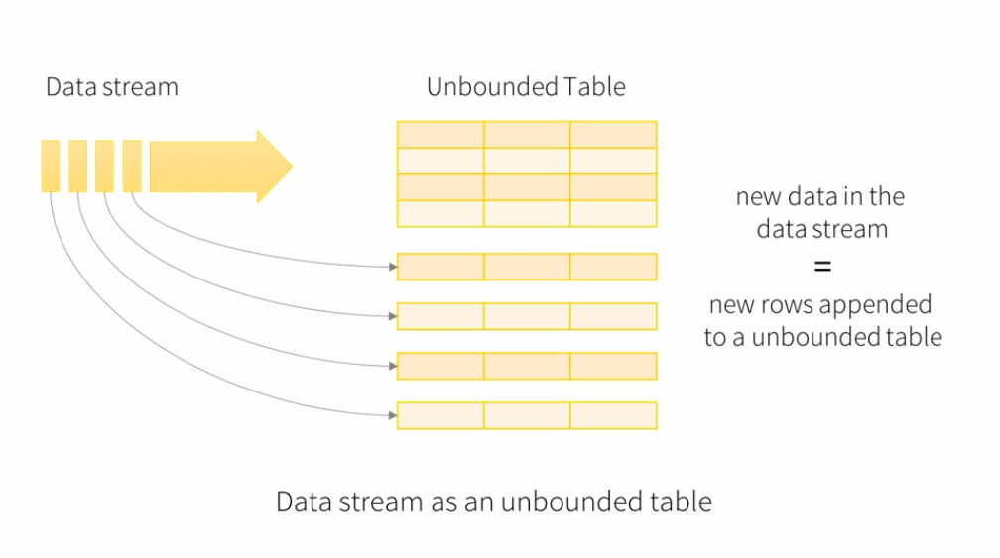

# Structured Streaming - Concepts

​	Structured Streaming is a Spark streaming processing engine built on top of the Spark SQL engine.

## Spark Streaming vs. Structured Streaming

​	Spark Streaming:

- consists on the division of the data in many micro batches, based on an interval of time.
- minimum interval of 100 milliseconds between each new micro batch.
- fault tolerant.
- works as Direct Streams (DStreams), very similar to RDDs.

​	Structured Streaming:

- continuous streaming.
- minimum interval of 1 millisecond.
- fault tolerant.
- works as dataframes or datasets, much better than RDDs.
- Spark version >2.3

## How does it work?

​	Streaming processing model very similar to a batch processing model.

