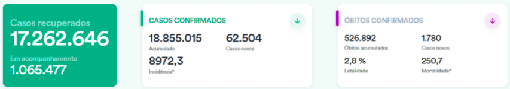

# Final Project

1. Enviar os dados para o HDFS

```bash
# copiando os arquivos para o diretório `input/`
docker cp input/HIST_PAINEL_COVIDBR_06jul2021 namenode:/home/

# acessando o container do namenode
docker exec -it namenode bash

# criando um diretório de destino
hdfs dfs -mkdir -p /user/rafael/final_project/

# enviando os dados para o HDFS
hdfs dfs -copyFromLocal /home/HIST_PAINEL_COVIDBR_06jul2021/ /user/rafael/final_project

# verificando se tudo deu certo
hdfs dfs -ls /user/rafael/final_project/HIST_PAINEL_COVIDBR_06jul2021
# output:
# Found 4 items
# -rw-r--r--   3 root supergroup   62492959 2022-04-25 19:01 /user/rafael/final_project/HIST_PAINEL_COVIDBR_06jul2021/HIST_PAINEL_COVIDBR_2020_Parte1_06jul2021.csv
# -rw-r--r--   3 root supergroup   76520681 2022-04-25 19:01 /user/rafael/final_project/HIST_PAINEL_COVIDBR_06jul2021/HIST_PAINEL_COVIDBR_2020_Parte2_06jul2021.csv
# -rw-r--r--   3 root supergroup   91120916 2022-04-25 19:01 /user/rafael/final_project/HIST_PAINEL_COVIDBR_06jul2021/HIST_PAINEL_COVIDBR_2021_Parte1_06jul2021.csv
# -rw-r--r--   3 root supergroup    3046774 2022-04-25 19:01 /user/rafael/final_project/HIST_PAINEL_COVIDBR_06jul2021/HIST_PAINEL_COVIDBR_2021_Parte2_06jul2021.csv
```

2. Otimizar todos os dados do HDFS para uma tabela Hive particionada por município.

```bash
docker exec -it jupyter-spark bash

# verificando o header de um dos arquivos .csv para fazer o schema no Hive
hdfs dfs -cat /user/rafael/final_project/HIST_PAINEL_COVIDBR_06jul2021/HIST_PAINEL_COVIDBR_2020_Parte1_06jul2021.csv | head -n 1
# output:
# regiao;estado;municipio;coduf;codmun;codRegiaoSaude;nomeRegiaoSaude;data;semanaEpi;populacaoTCU2019;casosAcumulado;casosNovos;obitosAcumulado;obitosNovos;Recuperadosnovos;emAcompanhamentoNovos;interior/metropolitana

spark-shell
```

```scala
import org.apache.spark.sql.types.{StructType, StructField, IntegerType, StringType, DateType}

val covidSchema = StructType(Seq(
    StructField("regiao", StringType),
    StructField("estado", StringType),
    StructField("municipio", StringType),
    StructField("coduf", IntegerType),
    StructField("codmun", IntegerType),
    StructField("codRegiaoSaude", IntegerType),
    StructField("nomeRegiaoSaude", StringType),
    StructField("data", DateType),
    StructField("semanaEpi", IntegerType),
    StructField("populacaoTCU2019", IntegerType),
    StructField("casosAcumulado", IntegerType),
    StructField("casosNovos", IntegerType),
    StructField("obitosAcumulado", IntegerType),
    StructField("obitosNovos", IntegerType),
    StructField("Recuperadosnovos", IntegerType),
    StructField("emAcompanhamentoNovos", IntegerType),
    StructField("interiorOrMetropolitana", IntegerType)
))

val covid = spark.read.option("header", true).option("sep", ";").schema(covidSchema).csv("/user/rafael/final_project/HIST_PAINEL_COVIDBR_06jul2021/")
// output:
// covid: org.apache.spark.sql.DataFrame = [regiao: string, estado: string ... 15 more fields]

covid.write.option("header", "true").option("delimiter", "|").csv("hdfs://namenode:8020/user/rafael/final_project/covid_csv/")
```

```bash
hdfs dfs -ls /user/rafael/final_project/covid_csv/
# output:
# Found 5299 items
# -rw-r--r--   2 root supergroup          0 2022-04-28 07:06 /user/rafael/final_project/covid_csv/_SUCCESS
# drwxr-xr-x   - root supergroup          0 2022-04-28 07:06 /user/rafael/final_project/covid_csv/municipio=Abadia de Goi?s
# drwxr-xr-x   - root supergroup          0 2022-04-28 07:06 /user/rafael/final_project/covid_csv/municipio=Abadia dos Dourados
# drwxr-xr-x   - root supergroup          0 2022-04-28 07:06 /user/rafael/final_project/covid_csv/municipio=Abadi?nia
# drwxr-xr-x   - root supergroup          0 2022-04-28 07:06 /user/rafael/final_project/covid_csv/municipio=Abaetetuba
# drwxr-xr-x   - root supergroup          0 2022-04-28 07:06 /user/rafael/final_project/covid_csv/municipio=Abaet?
# drwxr-xr-x   - root supergroup          0 2022-04-28 07:06 /user/rafael/final_project/covid_csv/municipio=Abaiara
# drwxr-xr-x   - root supergroup          0 2022-04-28 07:06 /user/rafael/final_project/covid_csv/municipio=Abar?
# drwxr-xr-x   - root supergroup          0 2022-04-28 07:06 /user/rafael/final_project/covid_csv/municipio=Abati?
# drwxr-xr-x   - root supergroup          0 2022-04-28 07:06 /user/rafael/final_project/covid_csv/municipio=Aba?ra
# drwxr-xr-x   - root supergroup          0 2022-04-28 07:06 /user/rafael/final_project/covid_csv/municipio=Abdon Batista
# drwxr-xr-x   - root supergroup          0 2022-04-28 07:06 /user/rafael/final_project/covid_csv/municipio=Abel Figueiredo
# drwxr-xr-x   - root supergroup          0 2022-04-28 07:06 /user/rafael/final_project/covid_csv/municipio=Abelardo Luz
# drwxr-xr-x   - root supergroup          0 2022-04-28 07:06 /user/rafael/final_project/covid_csv/municipio=Abre Campo
# drwxr-xr-x   - root supergroup          0 2022-04-28 07:06 /user/rafael/final_project/covid_csv/municipio=Abreu e Lima
# drwxr-xr-x   - root supergroup          0 2022-04-28 07:06 /user/rafael/final_project/covid_csv/municipio=Abreul?ndia
# drwxr-xr-x   - root supergroup          0 2022-04-28 07:06 /user/rafael/final_project/covid_csv/municipio=Acaiaca
# drwxr-xr-x   - root supergroup          0 2022-04-28 07:06 /user/rafael/final_project/covid_csv/municipio=Acajutiba
# drwxr-xr-x   - root supergroup          0 2022-04-28 07:06 /user/rafael/final_project/covid_csv/municipio=Acarape
# ...
```

3. Criar as 3 vizualizações pelo Spark com os dados enviados para o HDFS:



```scala
val recuperados = covid.select(
    sum("Recuperadosnovos").alias("Casos recuperados"),
    sum("emAcompanhamentoNovos").alias("Em acompanhamento")
)

recuperados.show
// output:
// +-----------------+-----------------+                                             
// |Casos recuperados|Em acompanhamento|
// +-----------------+-----------------+
// |       2920055795|        320793426|
// +-----------------+-----------------+


val casosConfirmados = covid.groupBy("regiao").agg(
    max("casosAcumulado").alias("Acumulado"),
    first(col("casosNovos")).alias("Casos novos")
).
where("regiao == 'Brasil'").
orderBy(desc("data"))

casosConfirmados.show(5)
// output:
// 


import org.apache.spark.sql.types.DoubleType

val obitosConfirmados = covid.select(
    max("obitosAcumulado").alias("Óbitos acumulados"),
    col("obitosNovos").alias("Casos novos"),
    (max("casosAcumulado").cast(DoubleType).divide(max("obitosAcumulado").cast(DoubleType))).alias("Letalidade"),
    (max("obitosAcumulado").divide(col("populacaoTCU2019")).multiply(10000)).alias("Mortalidade")
).orderBy("data")

obitosConfirmados.show(5)
// output:
// 
```

4. Salvar a primeira visualização como tabela Hive


5. Salvar a segunda visualização com formato parquet e compressão snappy


6. Salvar a terceira visualização em um tópico no Kafka


7. Criar a visualização pelo Spark com os dados enviados para o HDFS:


8. Salvar a visualização do exercício 6 em um tópico no Elastic


9. Criar um dashboard no Elastic para visualização dos novos dados enviados


using using
namespace namespace
std std
; ;
int int
main main
( (
) )
while while
true true
{ {
} }
cout cout
cerr cerr
<< <<
'e' 'e'
return return


using namespace std ;
int main ( )
{
while ( true )
{
cout << 'e' ;
cerr << 'e' ;
}
return 'e' ;
} 

using namespace std;
int main()
{
    while (true)
    {
        cout << 'e' ;
        cerr << 'e' ;
    }
    return 'e';
} 

